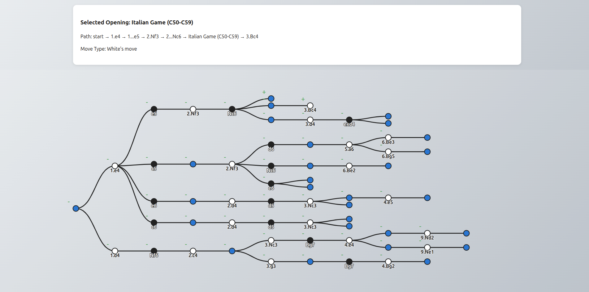

# Chess Opening Visualizer

**Interactive chess opening tree visualizer built with React and D3.**  
Explore, search, and analyze chess openings visually.



## Features

- Visualizes chess opening trees from structured data
- Interactive: expand/collapse, zoom, pan, and tooltips
- Color-coded for white, black, and opening nodes
- Responsive, modern UI

## Demo

[https://chess-openings.zahoor.dev/](https://chess-openings.zahoor.dev/)

## Getting Started

Clone the repository and run locally:

```bash
git clone https://github.com/its4zahoor/chess-opening-visualizer.git
cd chess-opening-visualizer
npm install
npm run dev
```

Then open [http://localhost:5173](http://localhost:5173) in your browser.

## Tech Stack

- [React](https://react.dev/)
- [Vite](https://vitejs.dev/)
- [D3.js](https://d3js.org/)

## Deployment

This project is ready for instant deployment on [Vercel](https://vercel.com/):

1. **Import your repo** at [vercel.com/new](https://vercel.com/new).
2. Vercel auto-detects Vite/React. Just click **Deploy**.
3. (Optional) Set your custom domain (see below).

## Custom Domain

1. Go to your Vercel dashboard → your project → Settings → Domains.
2. Add your domain (e.g., `chess.zahoor.dev` or `zahoor.dev/chess-opening-visualizer`).
3. Follow Vercel’s DNS instructions to point your domain.
4. Wait for DNS to propagate—done!

## Author

- Zahoor Malik ([zahoor.dev](https://zahoor.dev) / [@its4zahoor](https://github.com/its4zahoor))

---

**Enjoy exploring chess openings visually!**
